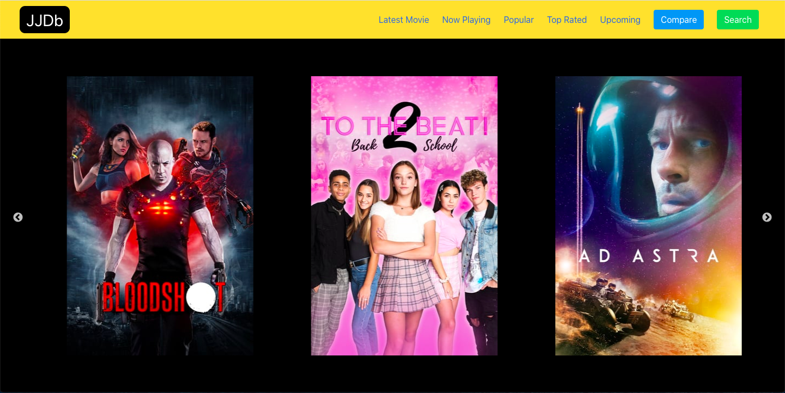

###  General Assembly, Software Engineering Immersive

# JJDB 🎥

Made by [Jamie Maxwell](https://github.com/Jamie66m) and [Joao Pinto](https://github.com/jdpintoGA)

## Overview

[Check out <strong>JJDB</strong> here](http://jamie66m.github.io/project-2/)

JJDB is a front-end web application built using React and a public API, allowing users to search for and compare their favourite movies. This was my second project at General Assembley and by the start of the project we had moved on from just 'vanilla' JavaScript, HTML and CSS to incorporating npm, webpack, babel and front-end frameworks and libraries.  

Joao and myself both decided quickly that we wanted to do a movie inspired app due to our shared passion in movies. We wanted to create an app where we could incorporate new features that we hadn't yet learn't in the classroom and make it look visually appealing to a user.

## The Brief
The app should:

* **Consume a public API** – this could be anything but it must make sense for your project.
* **Have several components** - At least one classical and one functional.
* **The app should include a router** - with several "pages".
* Have **semantically clean HTML** - you make sure you write HTML that makes structural sense rather than thinking about how it might look, which is the job of CSS.
* **Be deployed online** and accessible to the public.

## Technologies Used


| Category | List |
| ---- | --- |
| Languages                            | Javascript (ECMAScript6), CSS3, Sass, HTML5 |
| Front-end Web Application Framework  | React.js |
| Front-end Libraries                  | Axios, Slick, Proptypes |
| Server Environment                   | Node.js |
| CSS Framework                        | Bulma |
| REST client                          | Insomnia |
| Typefaces                            | Font Awesome|
| Module Bundler                       | Webpack |
| Text Editor                          | VS Code |
| Browser                              | Chrome |
| Version control | Git and GitHub


## Approach Taken

### The Router

The app utilises the React Router `<BrowserRouter>` to keep the UI in sync with the URL, this is done by the means of HTML-5 History API. As this was going to be a multi-page application it was important to get our paths right. We quickly decided that we only wanted to created paths from the homepage due to the time limit.

In order to keep our code clean, not repitive and for a better UI we kept the `<NavBar>` component outside of the `<Switch>` component

```js

import { BrowserRouter, Switch, Route } from 'react-router-dom'

const App = () => (
  <BrowserRouter>
    <NavBar />
    <Switch>
      <Route exact path="/" component={Home} />
      <Route path="/CompareMovie" component={CompareMovie} />
      <Route path="/SearchMovie" component={SearchMovie}></Route>
      <Route path="/LatestMovies" component={LatestMovies}></Route>
      <Route path="/NowPlaying" component={NowPlaying}></Route>
      <Route path="/Popular" component={Popular}></Route>
      <Route path="/TopRated" component={TopRated}></Route>
      <Route path="/Upcoming" component={Upcoming}></Route>
    </Switch>
  </BrowserRouter>
)
ReactDOM.render(<App />, document.getElementById('root'))

```

### Homepage



<strong>The Visual</strong>

The visuals for the homepage definitely took inspiration from IMBD with the black and yello contrast between the Navbar and body background color. We wanted to make it simple and easy on the eye for the user due to the overall simplicity of the app. 

<strong>The Navbar</strong>

The Navbar is relatively simple and has been designed using the CSS Framework Bulma. 

We wrapped the Navbar component in a `withRouter()` function when exporting the component so that it had access to this.props.history, which mean the Navbar had the capability to redirect the user. 

We wanted to be able to direct the user to all pages of the app from the Navbar. 

```js
import { withRouter } from 'react-router-dom'
```
```js
export default withRouter(NavBar)
```

Bulma gives you some nice features with the Navbar that definitely improve the UI. We wanted to incorporate their navbar-burger class for when a user reduced the width of the page. 

We used the lifecycle `componentDidUpdate()` for the NavBar as we wanted to make sure that when we redirected to a new page the navbar would no longer be active when the state of the navbar was in burger form.

```js
class NavBar extends React.Component {
  constructor() {
    super()
    this.state = {
      navMobileOpen: false,
    }
  }
  componentDidUpdate(prevProps) {
    this.props.location.pathname !== prevProps.location.pathname
      ? this.setState({ navMobileOpen: false })
      : ''
  }
```

```js 
          <div className="navbar-brand">
            <Link className="navbar-item" to="/" id="logo">
              JJDb
            </Link>
            <a
              role="button"
              className={`navbar-burger burger ${
                this.state.navMobileOpen ? 'is-active' : ''
              }`}
              aria-label="menu"
              aria-expanded="false"
              data-target="navbarBasicExample"
              onClick={() =>
                this.setState({ navMobileOpen: !this.state.navMobileOpen })
              }
            >
              <span aria-hidden="true"></span>
              <span aria-hidden="true"></span>
              <span aria-hidden="true"></span>
            </a>
          </div>
         
```
  

<strong>The Carousel</strong>

The Carousel on the homepage was created by installing the libraries <strong>'react-slick'</strong> and <strong>'slick-carousel'</strong> as well as adding two css stylesheets <strong>'slick'</strong> and <strong>'slick-theme'</strong> to the index.html. The `{SlickCarousel}` component is a separate smart component that was imported in the `{Home}` component which is called by `<BrowserRouter>`.

The SlicCarousel is a class component 

```js
class SlickCarousel extends React.Component {
  constructor() {
    super()
    this.state = {
      slickPoster1: '',
      slickPoster2: '',
      slickPoster3: '',
      slickPoster4: '',
      slickPoster5: '',
      slickPoster6: ''
    }
  }

```
```js
  componentDidMount() {
    axios
      .get(
        'https://api.themoviedb.org/3/movie/popular?api_key=77ec028641c2e3e8a7aeefbf47a24816&language=en-US&page=1',
      )
      .then(resp => {
        this.setState({ slickPoster1: resp.data.results[0].poster_path })
        this.setState({ slickPoster2: resp.data.results[1].poster_path })
        this.setState({ slickPoster3: resp.data.results[2].poster_path })
        this.setState({ slickPoster4: resp.data.results[3].poster_path })
        this.setState({ slickPoster5: resp.data.results[4].poster_path })
        this.setState({ slickPoster6: resp.data.results[5].poster_path })
      })
      .catch(err => console.error(err))
  }
```


